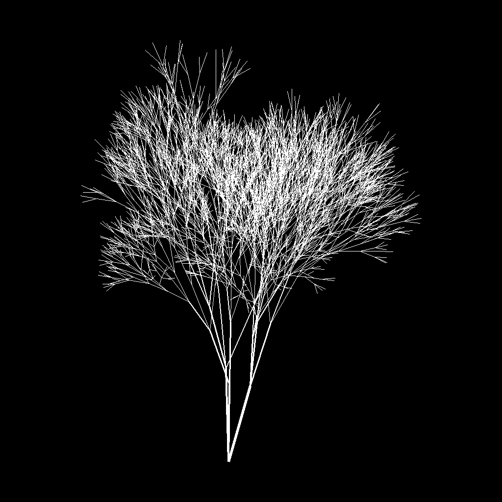
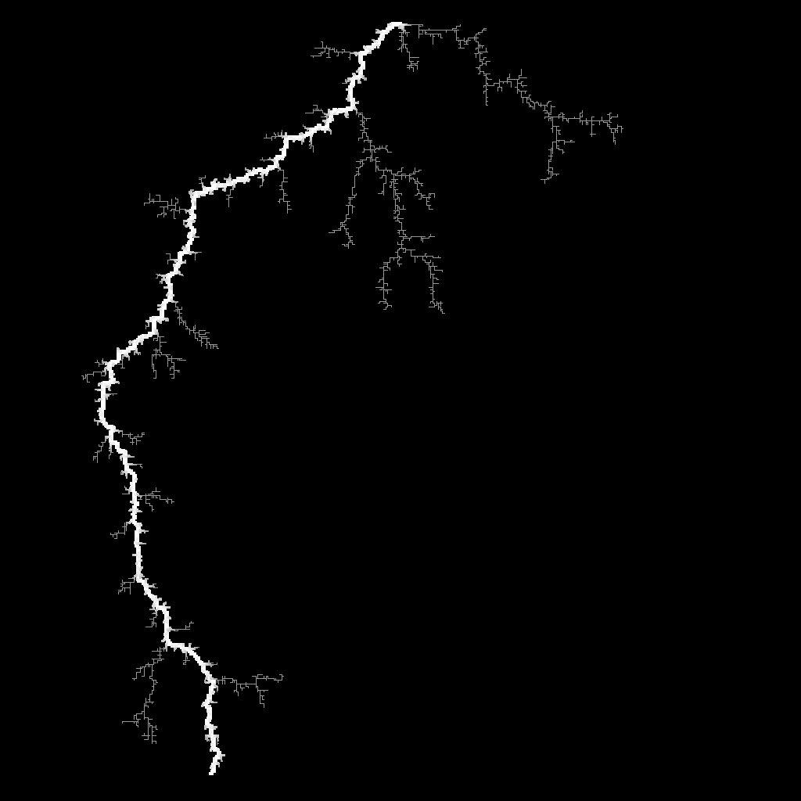
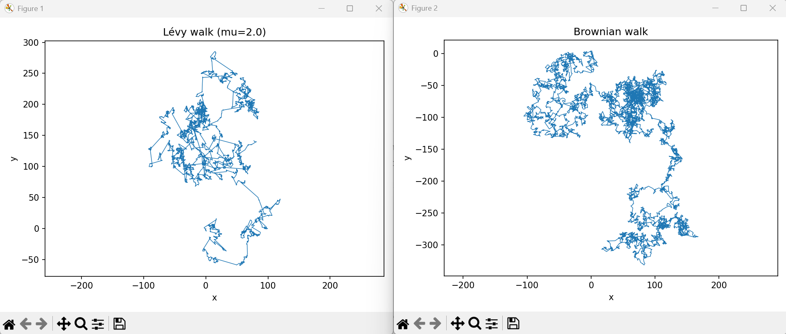
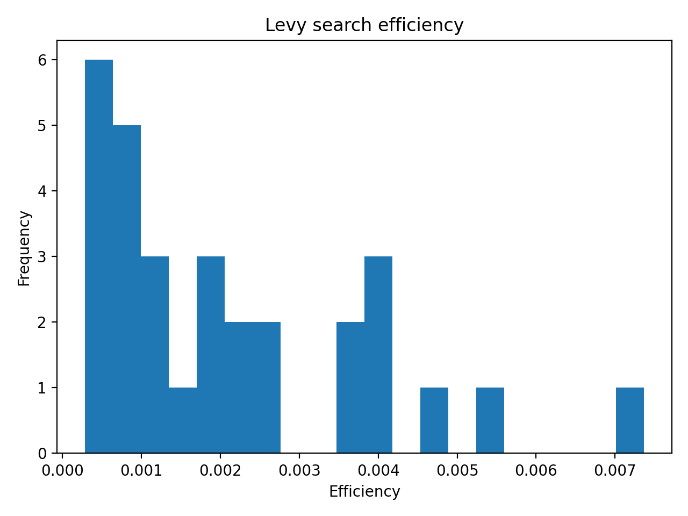
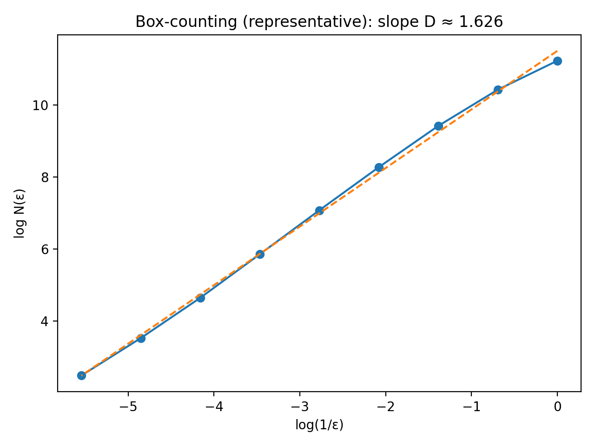

# Fractal Modelling Systems in Nature

A collection of computational models exploring how simple rules can reproduce complex natural structures.

This project forms part of my final-year Computer Science dissertation, investigating the extent to which fractal and stochastic models can approximate real-world patterns.

---

## Example Outputs

### Fractal Tree


### Lightning (DBM)


### Lévy vs Brownian Walk


---

## Quick Start

Install dependencies:

```bash
pip install -r requirements.txt
```

---

## Models

### Fractal Tree Model
- Rule-based branching system inspired by L-systems and biological constraints
- Includes:
  - Apical dominance
  - Golden-angle phyllotaxis
  - Pipe model (radius scaling)
- Outputs 3D structures and silhouette projections

---

### Lightning Model (DBM)
- Dielectric Breakdown Model (DBM)-style simulation
- Uses a Laplace field to guide branching growth
- Produces realistic lightning-like structures
- Includes:
  - Field-driven growth
  - Branching hierarchy
  - Structural metrics (tortuosity, branch lengths)

---

### Lévy Walk Model
- Simulates Lévy flight behaviour vs Brownian motion
- Includes:
  - Power-law step generation
  - Maximum likelihood fitting (MLE)
  - Log-likelihood model comparison
  - Search efficiency experiments

---

## Evaluation Pipelines

Each model includes a reproducible evaluation pipeline:

- Multi-seed experiments
- Quantitative metrics (e.g. fractal dimension, distributions)
- CSV outputs
- Plots for analysis

### Run examples:

```bash
python eval_tree_pipeline.py --n 30 --seed0 7 --out out_tree_eval
python eval_lightning_pipeline.py --n 30 --seed0 7 --out out_lightning_eval
python eval_levy_pipeline.py --n 30 --seed0 7 --out out_levy_eval
```

---

## Analysis Outputs

The evaluation pipelines generate quantitative outputs including:

- Fractal dimension (box-counting)
- Branching statistics (trees, lightning)
- Model comparison (power-law vs exponential)
- Search efficiency (Lévy vs Brownian)

Example analysis outputs:



